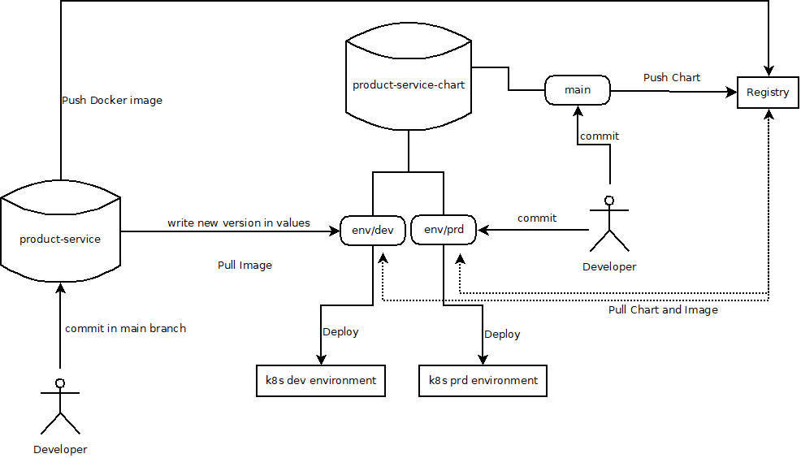
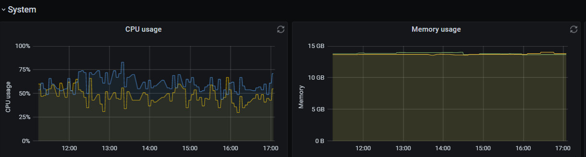

# SRE Challenge

* CI/CD: Description of a pipeline, where every commit of each developer goes through phases 
(stages) finishing on a development environment and promoting to production environment.

The backend pipeline would go through the next phases:
1. Prepare statement where we set all the variables that we'll use in the next steps of the pipeline, load libraries or whatever action that need to be done previously.
2. Compile the code and launch the tests (Unit and Integration tests)
3. Push the compiled code to an artifactory
4. Create a docker image and push it in a Registry
5. Trigger DEV deployment with the new changes

This pipeline would be completely executed when a commit is made in the main branch but on the case of other branches only the first two steps would be triggered.

As an improvement in the pipeline we could externalize it to a library and use input arguments to change pipeline behavior to help developers to better debug in case of needing it or even be able to create an image of a branch(that is not the main one) to also test the deployment process. For example:
```
backendPipeline(
  publishChanges: true
)
```
I would use a Helm Chart to deploy all the entities needed in a k8s cluster and the version to be deployed would be one specified in the values of the Chart.

Every time the chart is updated, it would be uploaded to a registry to have all the different deployment versions in case of a rollback is needed.

Every environment would have a branch with the values that needed to be overwritten in the chart and any commit on those branches would trigger a deployment process.



* Observability: Description of what would you implement to improve application 
observability. What would you do to enable quick and easy debug of the application?

To improve Obserbavility I would:
1. Send the logs to Elasticsearch/OpenSearch to be able to search over them using all the capabilities provided by Kibana/OpenSearch-Dashboards.
2. Export metrics to a Prometheus, those metrics would include service availability, request time, number of requests, etc. In the end all the metrics we consider useful to avoid possible problem or even detect points of improvement as bottle necks, common issues...

* SLOs: Our stakeholders expect to receive product data 99.5% of the requests that they made 
to product-service within 200ms. Describe how would you measure and alert to ensure SLOs 
are accomplished.

Having the metrics in prometheus would help us to configure alerts using Alertmanager and make them reach Opsgenie to warn our support team. In the alert I would include a link to a Grafana Dashboard that would show in a Graph the problem and when started.

I usually recommend to have other types of graphs in our Grafana Dashboard to even anticipate these kind of alerts, as CPU/Memory usage, number of requests, requests time avg, replicas available, current replicas vs. maximum replicas of the HPA, etc. This kind of Dashboards and other alerts could warn us even before having a critical failure and prevent them.



* Deployment: Description of a strategy for deploying the application containers in a high 
availability environment without downtime. How would you improve the resilience of the 
application?

As we have Helm charts we could easily improve the deployment process when we need but for this case I would recommend and initial number of 2 or 3 replicas in the deployment so in case of a failure you wouldn't loose the service. If the number of replicas is not the expected one I would configure an alert to warn support team to perform the action required to ensure we don't loose the service.

I would also configure an HPA to autoscale the number of replicas in case of having peaks of requests that could compromise the stability of our service and impact in the response time of the requests. Setting a proper amount of maximum replicas in HPA will warranty the correct performance of the service in case of hype sales, also configure an alert when the maximum number of replicas have been reached would be a good idea.

Having complete Grafana dashboards will help us to know before having a critical issue if we need to perform any other improvement in the deployment strategy and thanks to the deployment process that is really easy and quick.

* Resiliency: Currently, if product reviews service is down, we won’t serve any product data at 
all. Describe how would you improve product-service in a way that can continue fulfilling (at 
least partly) the expectations in the event that product reviews service is unavailable in a 
region or globally.

For this topic I would consider different options depending on the criticality of the external service(product reviews),so in case of product review service failure:

1. If we cannot afford to return a response without product reviews, I would configure an alert that would check the health of that service and create a runbook to alert the responsible team of the failure
2. If we can show non updated information I would implement Cache for that service, so in case of error in the service at least we would show the latest information we have.
3. If we can show no information in case of failure, then I would change the Exception treatment to return an empty response and avoid returning RuntimeExceptions.

The best option would be using all the points, but if that is not possible we can use those that could be accepted by business people.

For the second point, as the app is developed in Java, it's possible to use [Spring Cache](https://docs.spring.io/spring-framework/docs/3.2.x/spring-framework-reference/html/cache.html) that will help developers to implement the appropriate cache system according to business needs:
1. In memory
2. JCache
3. Couchbase
4. Redis
5. etc